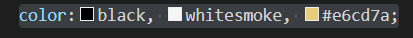
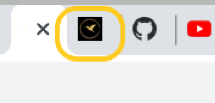
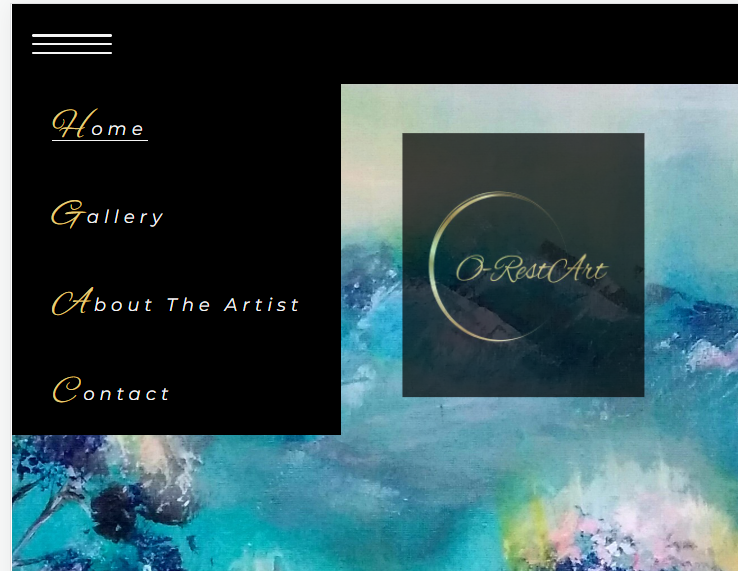
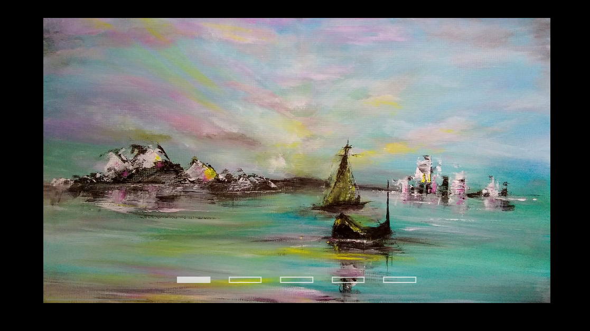
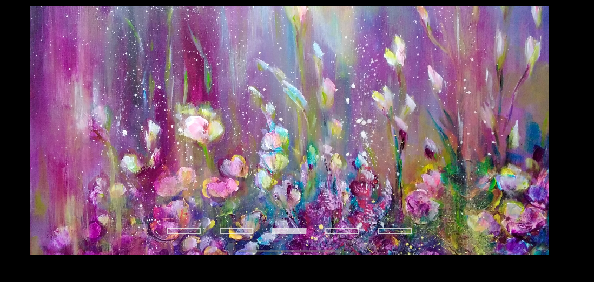
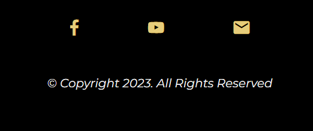
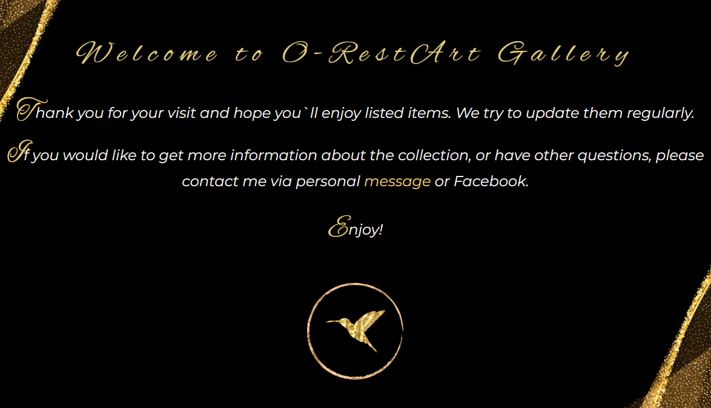
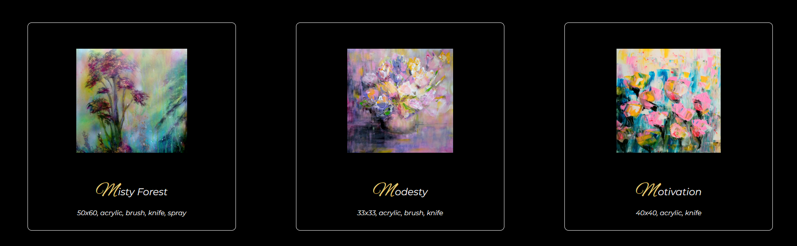
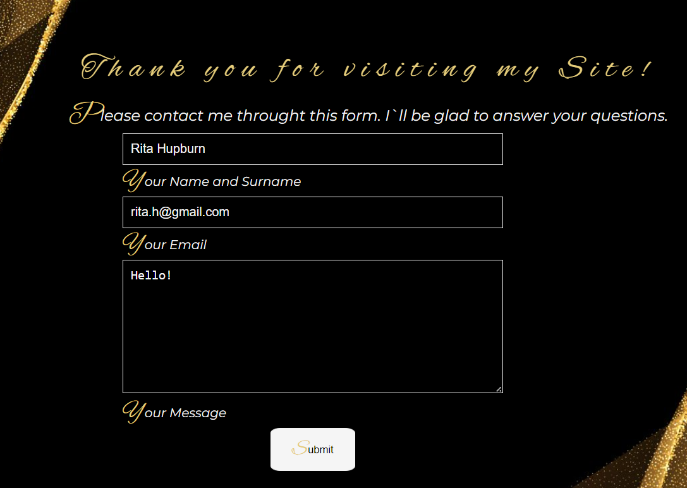
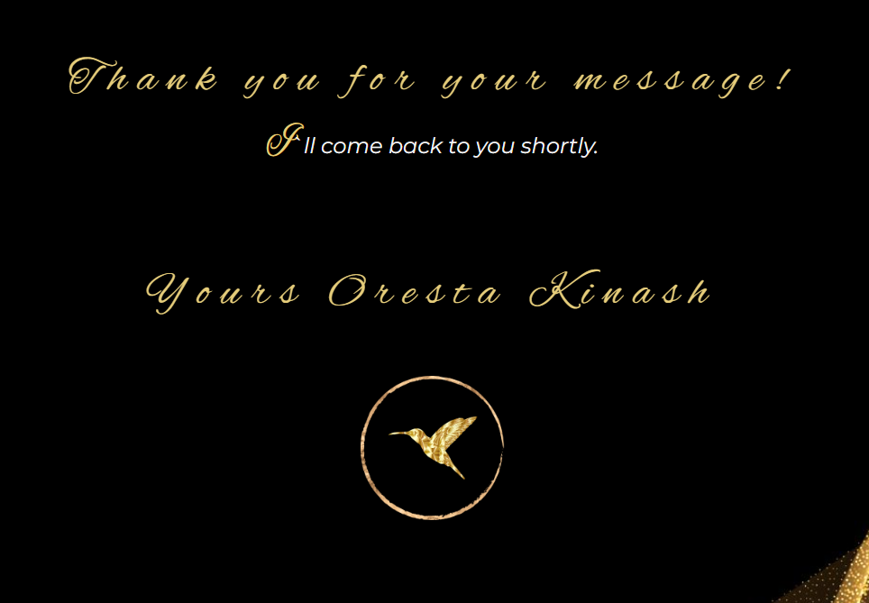

<h1>O-RestArt Gallery Website</h1>
 O-RestArt Gallery website is virtual art gallery. It allows visitors to see beautiful oil and acrylic paintings created by talented artist Oresta Kinash on various devices - big screens and monitors, laptops, tablets and personal cell phones. The name of the artist -Oresta is also embeded in the title and logo of this web page.  
The main goal of it is to present art in classical, sophisticated way, mainly to catch the eye on every single painting and provide positive esthetic effect. 
  
 
  
 The web-page is entirely created with HTML and CSS. It`s designed to be structured, visual, and intuitive, so the experience of using it is very simple and straigtforward.
  
  ## The Structure
  
 This Web page contains few main parts: 
  - Home Page
  - Gallery
  - About The Artist
  - Contact
  
  You can defy the Home Page, which is the main and contains cover photo of one of the paintings, the other (Gallery, About The Artist and Contact) are created on the same black and golden background, which provides consistancy and refers to the same styling. 
  There are only three main colors used in this design - Black, Whitesmoky and Golden (#e6cd7a) , which provide contrast and visibility. Together with logo and golden elements, compose nice background to colourful pictures in the gallery. 
  There are also two main fonts used: 
  - Alex and Brush
  - Monserrat
  
 Let`s have a closer look at features.
  
 ## Features
  
  **_Home Page_**
  
  **1. Favicon on the top of the Web Browser** 
  
 Small but nice touch which shows the object (a goden bird in the circle), visible when we open the web-page. Identifies the open tab at the top of web-brouser and makes this page recognisable. 
  
 
  
   
  
  
  
  **2. Responsive Navbar**
  
  Navbar is situated on the top of the web-page. It allows to navigate through the pages, shows the current page and allows easy navigation. It also contains media query, for smaller devices such as mobile phones, the user notice clickable "hamburger menu", which reviels a list.
  
  - _Laptops, Monitors, larger devices_
  
  
  
  - _Mobile Phones, small devices_
  
  
  
  
  **3. Home Page Carousel**
  
  Home paige contains picrure carousel, which allows the user to switch and list pictures using navigation bars or sliding them horizontally. 
  
         
  
  
  **4. Responsive Footer.**
  
  On every single page there is a responsive Footer, represented with icons. Icons are linked to social media where they redirect user when clicking on them.
  
  
  
  
  **_Gallery_**
  
  **1. Additional Shortcuts**
  
  Gallery also contains additional links to Contact page and Facebook embeded in text. When you hover words "message" and "Facebook", you`ll be able to use these shortcuts for contacting with the artist. 
  
  
  
  **2. Responsive Gallery**
  
  Here you can see the gallery with paintings and descriptions of every item.  Pictures are projected in rows and columns.  On smaller devices the quantity of colums decreases from three on big displays, to two on medium and one for mobile phones.
  
  
  
  **_About the Artist_**
  
  It`s a simple part, wchich contains some information about the artist, her heritage, with a picture and text.
  
  **_Contact_**
  
  It`s the last part of web-site with a contact form with inputs such as "Name and Surname", "E-mail Address", text field and a submittion button.  After submitting this form and sending over a message, the subscriber is redirected to Thank You page.
  
  
   
  
  ##Fututure Implementations
 
  There are few things which need to be implemented on this page: 
  
 - Gallery section - Creating modal windows using Java Script, which allow to select any picture from the gallery and zoom it; 
  
 - Create cards with prices and redirecting to the sales transactions, such as PayPal, credit cards (using Java Script);
  
 - Creating smooth and nice Navigation menu with Java Script;
  
 - Creating Submittion and automatic redirection for the owner side.
  
  
  ## Accessibility
  
I have been mindful during coding to ensure that the website is intuitive and easy to read, also nice and interesting to brows.  I have achieved this by:

- Using semantic HTML.
- Using descriptive alt attributes on images on the site.
- Ensuring that there is a sufficient colour contrast throughout the site.
- Providing shortcuts and additional detail, so the user will be easily navigated.
  
  #Technologies Used
  
  ##Languages Used
  
  HTML and CSS were used to create this website.
  
  ## Frameworks, Libraries & Programs Used
  
  - **Git** - For version control.
  - **Github** - To save and store the files for the website.
  - **Google Fonts** - To import the fonts used on the website.
  - **ZMDI** - For the iconography on the website.
  - **Canva** - Used to create wireframes, logos and icons.
  - **Favicon.io** - To create favicon.
  
  #Deployment & Local Development
  ## Deployment
  - Log in (or sign up) to Github.
  - Find the repository for this project, Project One - O-RestArt.
  - Click on the Settings link.
  - Click on the Pages link in the left hand side navigation bar.
  - In the Source section, choose main from the drop down select branch menu. Select Root from the drop down select folder menu.
  - Click Save. Your live Github Pages site is now deployed at the URL shown.
  
  ## Local Development
   
  **How to Fork**
  
To fork the Bully-Book-Club repository:

- Log in (or sign up) to Github.
- Go to the repository for this project, *https://freyalitto-projectone-97a9jav3gjj.ws-eu96.gitpod.io/*.
- Click the Fork button in the top right corner.
  
**How to Clone**
  
To clone the Bully-Book-Club repository:

- Log in (or sign up) to GitHub.
- Go to the repository for this project, *https://freyalitto-projectone-97a9jav3gjj.ws-eu96.gitpod.io/*.
- Click on the code button, select whether you would like to clone with HTTPS, SSH or GitHub CLI and copy the link shown.
 -Open the terminal in your code editor and change the current working directory to the location you want to use for the cloned directory.
- Type 'git clone' into the terminal and then paste the link you copied in step 3. Press enter.

  ##W3C Validator
  
  The W3C validator was used to validate the HTML on all pages of the website. It was also used to validate CSS in the style.css file.
  
  - HTML
  - No errors were returned when passing through the official [W3C validator](https://validator.w3.org/nu/?doc=https%3A%2F%2Fcode-institute-org.github.io%2Flove-running-2.0%2Findex.html)
- CSS
  - No errors were found when passing through the official [(Jigsaw) validator](https://jigsaw.w3.org/css-validator/validator?uri=https%3A%2F%2Fvalidator.w3.org%2Fnu%2F%3Fdoc%3Dhttps%253A%252F%252Fcode-institute-org.github.io%252Flove-running-2.0%252Findex.html&profile=css3svg&usermedium=all&warning=1&vextwarning=&lang=en#css)

##Unfixed Bugs
  
  Testing was ongoing throughout the entire build. I utilised Chrome developer tools while building to pinpoint and troubleshoot any issues as I went along.

The following issues were raised during my mid project meeting with my mentor:

1. I was struggling with building Naviagation Menu, which I wanted to be flexible for small devices and stretched for bigger devices. Tried to create "hamburger menu" using only HTML and CSS.
  
2.  There were many rewritings and corrections during Carousel creation, syncronising and resizing pictures together with slider and pointers. 
 
3. I managed to create nice flex gallery, but I also wanted to create a modal to each of the picture, which should be opened with a button. Modal was created, but it worked only for one picture, as the code was based on ID selector and some Java Script code. As there were too many pictures in the Gallery, it will be too time consuming create individual Modal box to each picture. I fond out that Java script For loop could solve this task, which I`ll be learning in the future. 

  4. During the building the site here and there I had to correct margins, paddings, alignes, to create esthetically nice front. 
  
   5. This project still might be corrected regarding better positioning, centralising, alighning elements etc. However I am planning to work on it and add new features  with time, when I`ll be gaining more knowlege and practice how to effectivly work with programming languages, tools, resources.
  
  ## Solved Bugs
  
  1. There were a few unpared tags, like 
 wchich I had to delete.
   2. In the footer there was additional empty <i> tag.
   3. Padding was provided in two different mesurements - pixels and %. That was corrected.
   
  
  ## Testing
  
 - Testing Navbar for it`s full responsive navigation, is it linked with other pages, how hovering works, also media queries on biller screens and small one. 
  
 - Resting Carousel,  it`s navigation, proportions of pictures.
  
 - Gallery presentation,  wrapping of cards on different sizes of screen, margins and paddings between cards on the page and inside.
  
  - Testing footbar icons and links, how they redirect the user to correct sites, hovering and proportions.
  
  - Submission form with paying attention if formats (for ex. emails) are correctly represented, how submission button redirects the user to Thank You page.
  
 - I tested the web-page with Lighthouse  within the Chrome Developer Tools fore performance, accessibility, best practices and SEO of the website.
 
 
 
 
 
  
  
  
  
  
   
   
    
       
   
    
    
    
    
    
  

  
  
  
  
  
  
  
  
  
  
  
  
  
  
  
  
  
  
  
  
  
  
  
  
  
  
  
  
  
  
  
  
  
  
  
  
  
 
  
