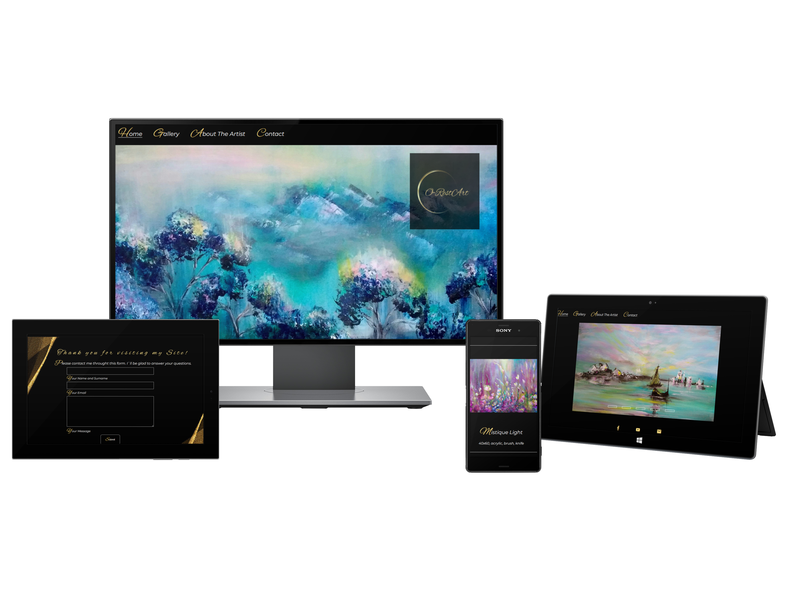
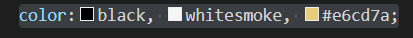
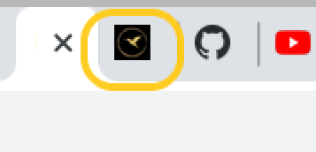

<h1>O-RestArt Gallery Website</h1>

 O-RestArt Gallery website is designed to be responsive website allowing visitors to view on a range of devices. It allows visitors to see the art gallery of a talented artist Oresta Kinash, who creates beautiful oil and acrylic paintings.
  
 
  
 The web-page is entirely created with HTML and CSS. It`s designed to be structured, visual, and intuitive, so the experience of using it is very simple and straigtforward.
  
  ## The Structure
  
 This Web page contains few main parts: 
  - Home Page
  - Gallery
  - About The Artist
  - Contact
  
  You can defy the Home Page, which is the main and contains cover photo of one of the paintings, the other (Gallery, About The Artist and Contact) are created on the same black and golden background, which provides consistancy and refers to the same styling. 
  There are only three main colors used in this design - Black, Whitesmoky and Golden (#e6cd7a) , which provide contrast and visibility. Together with logo and golden elements, compose nice background to colourful pictures in the gallery. 
  There are also two main fonts used: 
  - Alex and Brush
  - Monserrat
  
 Let`s have a closer look at features.
  
 ## Features
  
  **1. Favicon on the top of the Web Browser.** 
  
 Small but nice touch which shows the object (a goden bird in the circle), visible when we open the web-page. Identifies the open tab at the top of web-brouser and makes this page recognisable. 
  
 
  
   
  
  
  
  **
  
  
  
  
 
  
